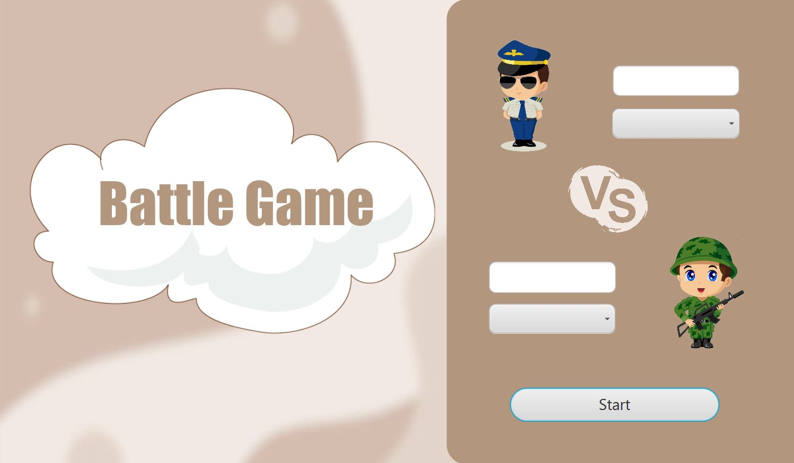
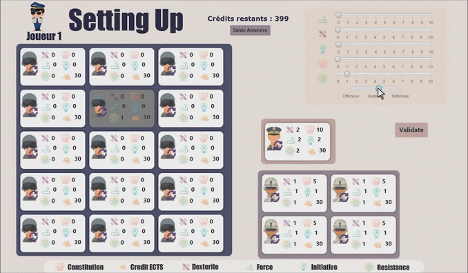
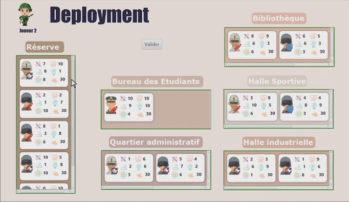
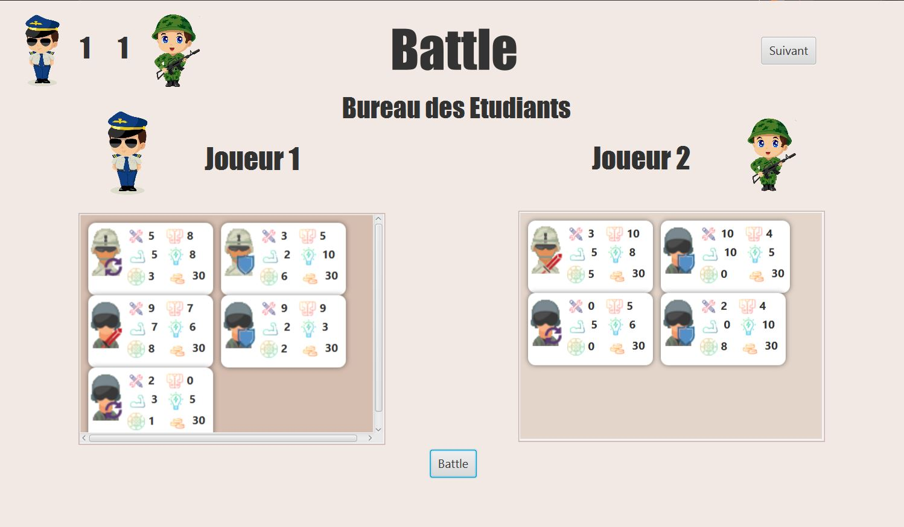
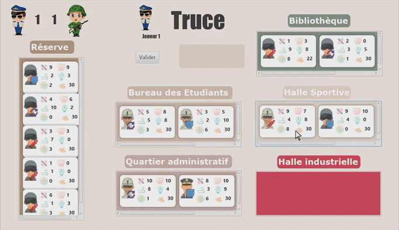
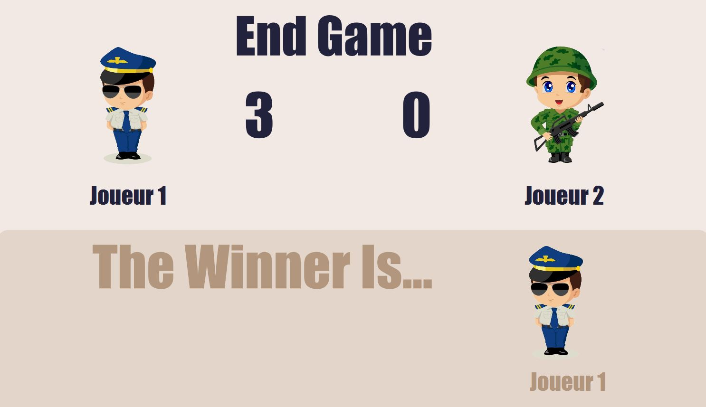

# BattleGameGUI - JavaLearning

J'ai réalisé ce projet dans le cadre du cours de Programmation orientée objet (LO02). J’ai d’abord commencé par la conception de mon application, à l’aide de diagrammes UML. J’ai pu ensuite passer à la phase de "développement". J'ai d'abord découvert le langage de programmation Java grâce aux TDs, TPs et tutoriels en ligne. J'ai ensuite appliqué et approfondi ces connaissances en essayant de créer l'application la plus efficace possible résolvant le problème présenté. Après avoir réalisé le moteur du jeu, je suis passé sur le design et le développement de l’interface graphique. J’ai même ajouté de nombreuses fonctionnalités pour améliorer l'expérience utilisateur comme la possibilité de générer aléatoirement l'ensemble des combattants, le système de carte les représentant et le drag & drop lors de leur déploiement.

Au travers de ce projet, j’ai acquis une expérience précieuse en matière de gestion de projet et de résolution de problèmes. J’ai également acquis une compréhension plus approfondie en programmation orientée objet et plus particulièrement en Java. Dans l'ensemble, l'expérience acquise sera précieuse pour les projets futurs.

# Overview
## Home Screen

BattleGame se joue à deux joueurs. Chaque
joueur représente un des sept programmes de l’UTT (ISI, RT, A2I, GI, GM, MTE, MM) et possède un effectif de 20
étudiants. A l’aide de son équipe, chaque joueur devra essayer de contrôler une majorité de zones d’influence.

## Initialisation

Chaque étudiant possède les caractéristiques suivantes :
- Crédits ECTS : ce nombre de crédits est initialement de 30. Lorsque la valeur atteint 0 ou moins, l’étudiant sort définitivement de la bataille.
- Dextérité : augmente les chances de "toucher" son adversaire en lançant son gobelet (dit le gobi) lors d’une attaque, ou d’esquiver lorsqu’il est attaqué. 
- Force : augmente les dégâts que peut infliger un étudiant à son adversaire de 10% par point affecté. 
- Résistance : permet de diminuer lesdégâts reçus de 5% par point affecté.
- Constitution : permet d’augmenter la constitution d’un étudiant en lui donnant des crédits ECTS supplémentaires.
- Initiative : sur une zone de combat, l’étudiant qui a la plus forte initiative effectue son action, puis c’est au tour de l’étudiant qui a la seconde meilleure initiative etc… 
- Stratégie : Chaque étudiant possède une stratégie qui peut être défensive, offensive ou aléatoire.

Les 20 protagonistes de chaque équipe sont hiérarchisés de la manière suivante :
- 15 étudiants avec les caractéristiques initiales présentées précédemment.
- 4 étudiants d’élite avec des caractéristiques initiales augmentées (Force +1, Dextérité +1, Résistance +1, Constitution +5, Initiative +1)
- 1 Maitre du gobi avec des caractéristiques initiales augmentées (Force +2, Dextérité +2, Résistance +2, Constitution +10, Initiative +2)

En début de partie, chaque joueur possède 400 points à distribuer à chacun de ses 20 combattants en les affectant
aux caractéristiques Force, Dextérité, Résistance, Constitution, Initiative. Chaque étudiant aura également une stratégie de combat.
 

## Déploiement

A cette étape, chaque joueur décide de répartir ses 20 combattants sur les 5 zones de combat.

Ces zones d’influence sont :
- La bibliothèque
- Le Bureau des Etudiants
- Le Quartier Administratif
- Les Halles industrielles
- La Halle Sportive

## Battle

Une zone est choisie aléatoirement et le combat fait rage jusqu'à ce qu'un protagoniste remporte la Battle.

- Soigner : choisir l'allié sur la même zone de combat ayant le moins de crédits ECTS. Les soins sont obtenu à l'issue d'un calcul mathématique réalisé en fonction des compétences des combattants
- Attaquer frontalement. Sur sa zone de combat, l’étudiant lance son gobi à l’ennemi qui a le moins de crédits ECTS. Les dégats sont obtenu à l'issue d'un calcul mathématique réalisé en fonction des compétences des combattants
- Une stratégie aléatoire consiste pour un étudiant à évoluer d’une stratégie à une autre demanière aléatoire.

## Trêve

A cette étape les 2 joueurs peuvent faire les actions suivantes de manière cachée :
- Affecter 1 ou plusieurs réservistes sur les zones de combats non contrôlées
- Si un joueur contrôle déjà une zone de combat, il peut redéployer ses combattant valides qui se trouvent sur cette zone vers d’autres zones de combats. Mais, un combattant doit rester sur la zone contrôlée pour maintenir l’ordre et l’influence du programme. 
- On ne peut pas redéployer de combattants d’une zone dont le combat n’est pas fini.

## Fin de la partie

Les Battles et les trêves se répètent jusqu’à ce qu’un joueur contrôle au moins 3 zones et est donc déclaré vainqueur.

